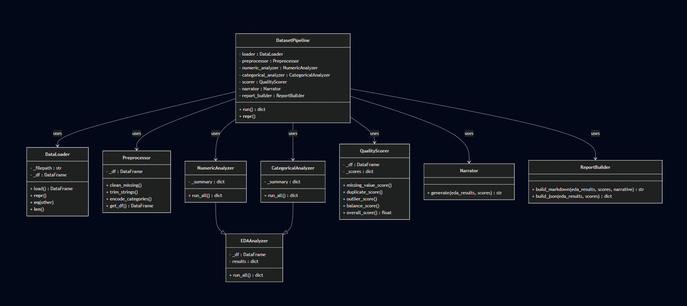

# DatasetSense: Automated EDA Narrator + Data Quality Scoring Tool
## 1. Project Overview
DatasetSense is a Python tool that performs **automated exploratory data analysis (EDA)** and computes a **dataset quality score (0–100)**. It generates **human-readable insights** and produces a **markdown report** summarizing dataset characteristics and quality.  

The project demonstrates **object-oriented programming (OOP)** concepts including **encapsulation, inheritance, polymorphism, composition, and dunder methods**.

---

## 2. Team Members
| Member | Role |
|--------|------|
| Mark Orano | DataLoader + Preprocessor |
| Jomar Ligas | NumericAnalyzer + CategoricalAnalyzer (EDA) |
| Lex Leander Lumantas | QualityScorer |
| Philip Andree Tupas | Narrator |
| Josh Ganhinhin | DatasetPipeline + ReportBuilder + Integration |

---

## 3. Features

### Automated EDA
- Numeric analysis: mean, std, quartiles, outliers
- Categorical analysis: value counts, top categories
- Missing value and duplicate detection
- Correlation matrix for numeric columns

### Data Quality Scoring
- Missing values, duplicates, outliers, balance score
- Weighted overall score (0–100)
- Simple verdict: Excellent / Good / Fair / Poor

### Report Generation
- Narrative insights in human-readable sentences
- Markdown-formatted quality report
- Optional JSON output

---

## 4. Object-Oriented Design

| OOP Concept        | How it’s applied in your project                                                                                                                                                                             |
| ------------------ | ------------------------------------------------------------------------------------------------------------------------------------------------------------------------------------------------------------ |
| **Classes**        | There are **6 core classes**: `DataLoader`, `Preprocessor`, `EDAAnalyzer` (base), `NumericAnalyzer`/`CategoricalAnalyzer` (children), `QualityScorer`, `Narrator`, `ReportBuilder`, and `DatasetPipeline`.  |
| **Encapsulation**  | Protected attributes (e.g., `_df`, `_eda`, `_scores`) are used in classes. Getters like `get_df()` in `Preprocessor` and `DataLoader` provide controlled access.                                            |
| **Inheritance**    | `NumericAnalyzer` and `CategoricalAnalyzer` **inherit** from `EDAAnalyzer`.                                                                                                                                 |
| **Polymorphism**   | `run_all()` is **overridden** in `NumericAnalyzer` and `CategoricalAnalyzer` to handle numeric vs categorical data differently.                                                                             |
| **Dunder Methods** | `DataLoader` has `__repr__`, `__eq__`, `__len__`; `DatasetPipeline` has `__repr__`.                                                                                                                         |
| **Composition**    | `DatasetPipeline` **contains/uses** instances of `DataLoader`, `Preprocessor`, `EDAAnalyzer`, `QualityScorer`, `Narrator`, `ReportBuilder`.                                                                 |


---

## 5. Project Structure

```
data-narrator/
├─ data/                    # CSV files and sample datasets
│  └─ sample.csv
├─ src/                     # Main modules (importable and reusable)
│  ├─ __init__.py
│  ├─ loader.py             # Loads CSV files
│  ├─ preprocessor.py       # Cleans and preprocesses data
│  ├─ eda_analyzer.py       # Numeric and categorical EDA analysis
│  ├─ quality_scorer.py     # Computes data quality scores
│  ├─ narrator.py           # Generates human-readable insights
│  ├─ report_builder.py     # Builds markdown reports
│  └─ orchestrator.py       # DatasetPipeline: orchestrates all classes
├─ demo.py                  # Ready-to-run mini demo for practical example
├─ tests/                   # Unit tests (optional)
├─ notebooks/               # Jupyter notebooks for exploration (optional)
├─ README.md                # Project documentation
└─ requirements.txt         # Python dependencies
```
# Dataset Facade UML



---

| Requirement                                  | Project Implementation                                                                                                                                                                                                                                                                                      |
| -------------------------------------------- | ----------------------------------------------------------------------------------------------------------------------------------------------------------------------------------------------------------------------------------------------------------------------------------------------------------- |
| **At least 5 useful methods across modules** | Example methods: <br>1. `DataLoader.load()` – loads CSV <br>2. `Preprocessor.trim_strings()` – trims text columns <br>3. `NumericAnalyzer.run_all()` – numeric summary <br>4. `QualityScorer.overall_score()` – calculates weighted quality <br>5. `Narrator.generate()` – returns human-readable narrative |
| **Must be importable and reusable**          | All modules are in `src/` with proper `__init__.py`, allowing imports like: <br>`from src.loader import DataLoader`                                                                                                                                                                                         |
---

